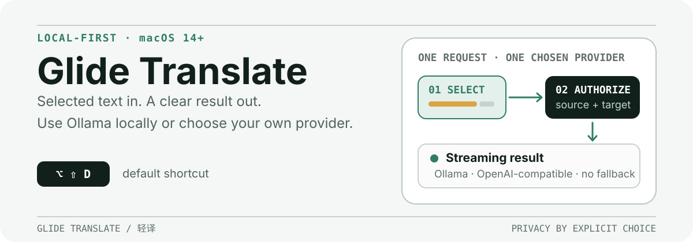

<p align="center">
  
</p>

<p align="center">
  <a href="./README.md">English</a> · <a href="./README.zh-CN.md">简体中文</a>
</p>

<p align="center">
  <a href="https://github.com/ZacharyJiao/GlideTranslate/releases/tag/v0.2.1"></a>
  
  
  <a href="./LICENSE"></a>
</p>

Glide Translate (轻译) is an open-source, privacy-focused macOS menu-bar translator for selected text and manual input. It runs on macOS 14 or later and works with local Ollama models by default or an OpenAI-compatible service that you configure.

This README documents **v0.2.1**.

Glide Translate uses Ollama on your Mac by default. If you choose a service on your local network or in the cloud, the app shows where the text will be sent and asks before sending it there.

> [!IMPORTANT]
> The downloadable `v0.2.1` build is an Apple-silicon prerelease. It is ad hoc signed for bundle-integrity checks, but it is not Developer ID signed or notarized. Read [Install the prerelease](#install-the-prerelease) before opening it.

## The v0.2.1 experience

v0.2.1 keeps the v0.2.0 experience upgrade and tightens the everyday flow:

- **A result panel that fits the translation.** Short translations stay compact. Longer translations get more reading space and can scroll without hiding Copy, Retry, Change Preset, Pin, or Close. If you scroll up, **Back to Latest** returns to the newest text.
- **Temporary panels dismiss reliably.** Arrow and Delete selection events dismiss a temporary result panel after the selection clears, while pinned panels remain available.
- **Common actions in the menu bar.** See whether translation is ready or paused, choose a preset, translate selected text, open manual translation, or go to Settings.
- **Consistent app windows.** Manual Translation, onboarding, Settings, prompt editing, and history now use the same layout and keyboard behavior.
- **A consistent app icon.** The app icon, Dock, Finder, and menu-bar icon all use the same logo and colors.

## Highlights

- **Selected-text translation.** Select text in another app, press `⌥⇧D`, and read the translation in a panel beside the selection.
- **Manual input without Accessibility access.** If there is no usable selection when you press the shortcut, the app opens Manual Translation. Manual input does not read the clipboard.
- **Local and self-chosen providers.** Use Ollama's native API or an OpenAI-compatible endpoint. Requests stay with the selected provider; the app does not silently fall back to another service.
- **Opt-in automatic capture.** Mouse and keyboard selection capture are disabled by default and can be enabled only for applications you add to the allowlist.
- **Useful presets.** Built-in presets cover accurate translation, natural translation, word explanation, sentence explanation, and polishing. You can duplicate them or create encrypted custom presets.
- **Private history controls.** History is disabled by default. When enabled, completed source and result text is encrypted at rest, searchable locally, and kept within configurable age and count limits.
- **English and Simplified Chinese UI.** The interface language can be changed in Settings without changing the system language.

## How a request moves through the app

```text
Selected text or manual input
        ↓
Check the trigger, source app, and where text will be sent
        ↓
The selected Ollama or OpenAI-compatible provider
        ↓
Streaming result panel → copy, retry, change preset or pin
```

Automatic capture works only after you turn it on, allow the source app, and enable mouse or keyboard capture. If the translation service is not on this Mac, you must also allow that app to use that service.

## Install the prerelease

The [v0.2.1 prerelease](https://github.com/ZacharyJiao/GlideTranslate/releases/tag/v0.2.1) provides one Apple-silicon DMG for macOS 14 or later.

1. Download `GlideTranslate-0.2.1-macos-arm64.dmg` from the release page.
2. Open the DMG, then drag `GlideTranslate.app` to **Applications**.
3. Eject the DMG from Finder.
4. Try to open the installed app once. Because this prerelease is unidentified and unnotarized, macOS may block it.
5. If macOS blocks it, open **System Settings → Privacy & Security**, find the Glide Translate message in the Security section, click **Open Anyway**, and confirm **Open**.
6. If Finder offers Control-click → **Open**, you may use that as an alternate first-launch path; otherwise use **Open Anyway** above.

Do not disable Gatekeeper or remove quarantine attributes. The release is not claimed to support Intel Macs or Universal 2.

For the full trust model and optional bundle checks, see [Distribution](docs/distribution.md). Release changes are summarized in the [Changelog](CHANGELOG.md).

## First run

The onboarding window walks through four decisions:

1. **Before you begin.** Review when the app reads selected text and where translations are sent.
2. **Local Ollama.** Detect an existing Ollama service and choose one of its installed models, or enter an installed model name manually.
3. **Global shortcut.** The default is `⌥⇧D`. If it is already in use, the app offers `⌥⇧F`, `⌥⇧G`, or `⌥⇧T`.
4. **Accessibility.** Grant access only if you want selected-text capture. You can skip it and use manual input.

Glide Translate does not install Ollama or download a model for you. A basic local setup is:

```bash
brew install ollama
ollama serve
ollama pull <model>
```

Keep `ollama serve` running, then return to onboarding or **Settings → Models**, detect the service, and select the installed model.

## Use Glide Translate

### Translate selected text

1. Select text in a supported application.
2. Press `⌥⇧D`, or choose **Translate Selected Text** from the menu-bar menu.
3. The result panel shows the translation as it arrives, along with the language direction and whether the service is on this Mac, the local network, or the cloud.
4. Use the panel to copy, retry, change the preset, pin the result, or close it.

Selection capture depends on the source application's Accessibility support. If the shortcut cannot read the selection, Glide Translate opens Manual Translation or explains what to do next. It does not send unrelated text.

### Translate manual input

Press the shortcut with no usable selection to open **Manual Translation**. Enter text, choose source and target languages, a preset, and a provider, then press `⌘Return` or click **Translate**. This path does not require Accessibility permission.

### Turn on automatic capture

Automatic capture is off by default. To enable it:

1. Grant Accessibility access in **Settings → Selection**.
2. Add each source application under **Applications**.
3. Enable mouse selection and/or keyboard selection.
4. Turn on **Automatic capture** in **Settings → General**.
5. For a Local Network or Cloud provider, open **Settings → Models**, load the automatic-application list for that provider, and authorize the required applications.

You can pause or resume automatic capture from the menu-bar menu without changing the rest of the configuration.

## Configuration

### General

| Setting | What it controls | Default |
| --- | --- | --- |
| UI language | English or Simplified Chinese | English |
| Target language | Automatic, English, or Simplified Chinese | Automatic |
| Shortcut | Global selected-text action | `⌥⇧D` |
| Launch at login | Start Glide Translate after login | Off |
| Default preset | Preset used by shortcut and automatic capture | Accurate Translation |
| Default provider | Provider used unless manual input selects another | None until onboarding/configuration |
| Automatic capture | Global automatic-capture switch | Off |

### Selection

| Setting | Range or behavior | Default |
| --- | --- | --- |
| Applications | Per-app allowlist for automatic capture | Empty |
| Mouse selection | Observe mouse selection events in allowed apps | Off |
| Keyboard selection | Observe keyboard selection events in allowed apps | Off |
| Debounce | `100–2,000 ms`, in `50 ms` steps | `350 ms` |
| Character limit | `1–20,000` characters | `2,000` |
| Shortcut clipboard fallback | Used only when you press the shortcut; may replace clipboard contents | Off |

The clipboard fallback is never used by automatic capture. When enabled, it may synthesize `Command-C` and read the resulting plain text. The app does not claim to restore the previous clipboard contents.

### Models

Each provider stores a protocol, endpoint, model name, and optional credential. Credentials are kept in macOS Keychain.

- **Ollama native:** the built-in default points to Ollama on this Mac, using port `11434`.
- **OpenAI-compatible:** configure the endpoint and model required by your service.
- **Model discovery and connection test:** available from the selected provider's settings.
- **Timeouts:** connection `1–60 s` (default `5 s`), first token `5–600 s` (default `120 s`), and stream idle `5–120 s` (default `30 s`).
- **Confirm where text is sent:** required for Local Network and Cloud providers. If the service address changes or cannot be identified, the app asks again before sending text.
- **Automatic applications:** off-device automatic capture requires a second, provider-specific application authorization.

### Prompts

The built-in presets are read-only, but they can be duplicated and edited as custom presets. A custom template:

- must contain `{text}` exactly once;
- may contain `{source_language}` and `{target_language}`;
- rejects unknown placeholders; and
- uses `{{` and `}}` when a literal brace is needed.

Custom preset names are limited to 80 characters. Explanations and templates are each limited to 8,000 characters. Custom presets are encrypted at rest.

### Privacy and history

History is off by default. Enabling it affects future completed translations; disabling it does not delete existing records.

| Setting | Range or behavior | Default |
| --- | --- | --- |
| Retention | `1–365` days | `30 days` |
| Maximum records | `1–10,000` | `1,000` |
| Excluded applications | Skip history for selected allowed apps | None |
| Search | Decrypt and search source/result text locally | — |
| Diagnostics | Preview a category-only JSON report before saving | — |
| Reset | Remove app data, credentials, keys and runtime configuration in stages | — |

See [Privacy](PRIVACY.md) for the complete data flow, storage rules, logging exclusions, diagnostic fields, and reset limitations.

## Compatibility and current limits

- The app requires macOS 14 or later.
- The downloadable build is verified for Apple silicon only.
- Selected-text capture varies with the source application, selected control, Accessibility support, and Secure Input state. Universal compatibility is not claimed.
- The current Codex desktop surface does not expose automatic Accessibility selection. Its shortcut can work when the user enables the shortcut-only clipboard fallback.
- The prerelease has no Developer ID signature, notarization ticket, App Store receipt, automatic updater, Intel validation, or Universal 2 claim.

See the tested application matrix and trigger-specific notes in [Compatibility](docs/compatibility.md).

## Build from source

Requirements:

- macOS 14 or later;
- full Xcode at `/Applications/Xcode.app`; and
- the repository's current validation baseline of Xcode 26.6 and Swift 6.3.3 on arm64 macOS.

Run the Swift package tests and build the unsigned Debug app:

```bash
DEVELOPER_DIR=/Applications/Xcode.app/Contents/Developer swift test
DEVELOPER_DIR=/Applications/Xcode.app/Contents/Developer \
  xcodebuild -project GlideTranslate.xcodeproj -scheme GlideTranslate \
  -configuration Debug -destination 'platform=macOS' \
  CODE_SIGNING_ALLOWED=NO build
```

Build and launch a local Debug app:

```bash
DEVELOPER_DIR=/Applications/Xcode.app/Contents/Developer \
  ./script/build_and_run.sh run
```

More detail is available in [Building](docs/building.md) and [Verification](docs/verification.md).

## Contributing and project documents

Before opening a pull request, read [Contributing](CONTRIBUTING.md). Use synthetic test content and do not include credentials, selected text, prompts, responses, private endpoints, local paths, diagnostics, or machine details in public artifacts.

- [Privacy](PRIVACY.md)
- [Compatibility](docs/compatibility.md)
- [Distribution](docs/distribution.md)
- [Building](docs/building.md)
- [Verification](docs/verification.md)
- [Changelog](CHANGELOG.md)
- [Security policy](SECURITY.md)
- [Third-party notices](THIRD_PARTY_NOTICES.md)
- [MIT License](LICENSE)
